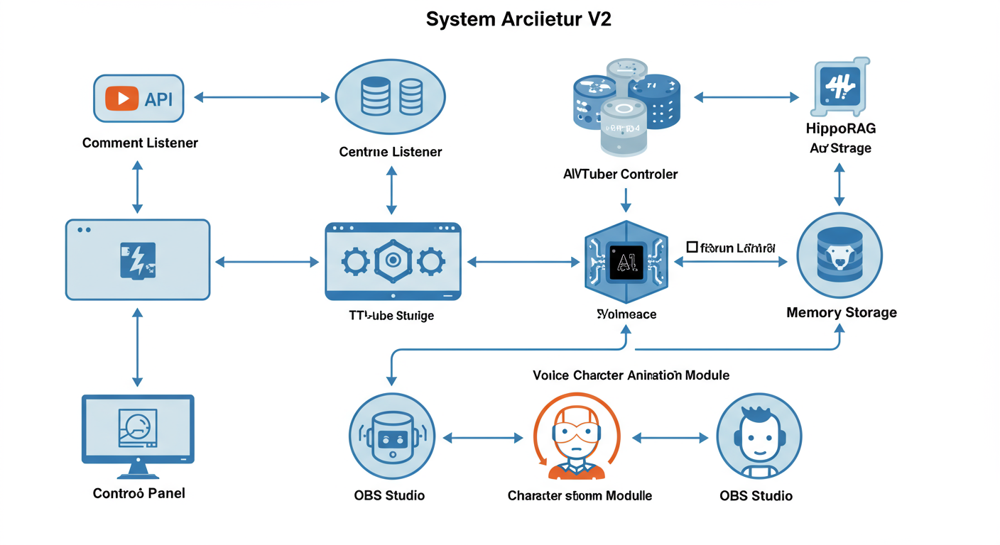
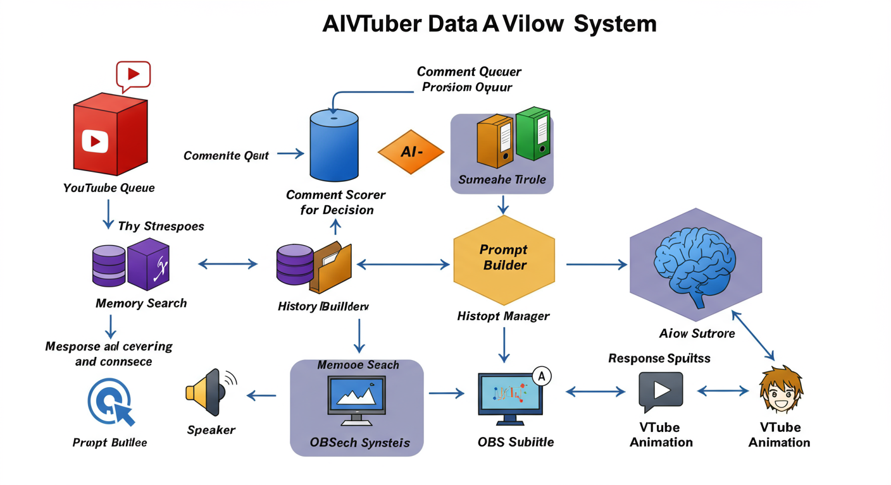

# AIVTuber v2 システムアーキテクチャ

## 目次
1. [システム概要](#システム概要)
2. [アーキテクチャ図](#アーキテクチャ図)
3. [コアコンポーネント](#コアコンポーネント)
4. [データフロー](#データフロー)
5. [処理シーケンス](#処理シーケンス)
6. [技術スタック](#技術スタック)

## システム概要

AIVTuber v2は、YouTubeライブ配信においてAIがリアルタイムでコメントに応答し、VTuberとして振る舞うシステムです。以下の特徴を持っています：

- **リアルタイム処理**: YouTubeのコメントを即座に取得・処理
- **インテリジェントな応答**: GPT-4による自然な会話生成
- **長期記憶**: HippoRAGによる会話履歴の保存と活用
- **マルチモーダル出力**: テキスト、音声、アニメーションの統合

## アーキテクチャ図



## コアコンポーネント

### 1. コメント取得層（Input Layer）

#### CommentListener
- **役割**: YouTubeライブチャットの監視
- **技術**: pytchat (YouTube Chat API wrapper)
- **処理内容**:
  - リアルタイムでコメントを取得
  - スーパーチャット、メンバーシップギフトなどの特殊コメントも処理
  - 非同期処理によるノンブロッキング実装

```python
# コメント取得の基本フロー
async def listen_comments(self, video_id: str):
    chat = pytchat.create(video_id=video_id)
    while chat.is_alive():
        for comment in chat.get().sync_items():
            await self.comment_queue.put(comment)
```

### 2. 処理層（Processing Layer）

#### CommentScorer
- **役割**: コメントの重要度を評価
- **アルゴリズム**:
  - コメント長による基本スコア
  - スーパーチャット/メンバーシップによる加点
  - 繰り返しコメントの減点
  - 時間的近接性の考慮

#### MemorySearcher & HippoRAG
- **役割**: 関連する過去の会話を検索
- **技術**: 
  - Sentence Transformers (cl-nagoya/sup-simcse-ja-large)
  - FAISS Vector Database
- **処理**:
  - コメントのベクトル化
  - 類似度検索による関連記憶の抽出

### 3. AI応答生成層（AI Response Layer）

#### PromptBuilder
- **役割**: GPT-4へのプロンプト構築
- **構成要素**:
  - システムプロンプト（キャラクター設定）
  - 会話履歴
  - 関連する長期記憶
  - 現在のコメント

#### Responder
- **役割**: GPT-4を使用した応答生成
- **特徴**:
  - ストリーミング対応
  - トークン数管理
  - エラーハンドリング

### 4. 出力層（Output Layer）

#### Speech (Style-BERT-VITS2)
- **役割**: テキストを音声に変換
- **処理**:
  1. テキストの前処理（句読点、改行処理）
  2. Style-BERT-VITS2 APIへのリクエスト
  3. 音声ファイルの生成と再生

#### VTSAnimator
- **役割**: VTube Studioのキャラクターアニメーション制御
- **機能**:
  - WebSocket経由でのホットキートリガー
  - 表情変化のランダム化
  - リップシンク対応

#### OBSConnector
- **役割**: 配信画面の制御
- **機能**:
  - 字幕（応答テキスト）の表示
  - シーン切り替え
  - コメント欄の更新

### 5. 制御層（Control Layer）

#### AIVTuberController
- **役割**: 全体の統括制御
- **責務**:
  - 各コンポーネントの初期化と管理
  - 非同期処理の調整
  - エラーハンドリングとリカバリー

#### Control Panel (Streamlit + FastAPI)
- **役割**: ユーザーインターフェース
- **機能**:
  - 配信の開始/停止
  - パラメータ調整
  - ステータスモニタリング

## データフロー



### メインフロー

1. **コメント取得**
   ```
   YouTube API → CommentListener → Comment Queue
   ```

2. **コメント処理**
   ```
   Comment Queue → CommentScorer → Filtered Comments
   ```

3. **コンテキスト構築**
   ```
   Filtered Comments + History + Memory → PromptBuilder → Context
   ```

4. **AI応答生成**
   ```
   Context → GPT-4 → Response Text
   ```

5. **マルチモーダル出力**
   ```
   Response Text → Speech → Audio
   Response Text → OBS → Subtitle
   Response Text → VTSAnimator → Animation
   ```

## 処理シーケンス


### 通常のコメント応答シーケンス


### 独り言モード（コメントがない時）

```python
async def continuous_response_loop(self):
    while self.is_running:
        if self.comment_queue.empty():
            # 最後の応答から一定時間経過したら独り言を生成
            if time.time() - self.last_response_time > 30:
                await self.generate_monologue()
        await asyncio.sleep(1)
```

## 技術スタック

### バックエンド
- **Python 3.10+**: メイン開発言語
- **FastAPI**: REST APIサーバー
- **asyncio**: 非同期処理
- **PyTorch**: 深層学習フレームワーク（HippoRAG用）

### AI/ML
- **OpenAI GPT-4**: 応答生成
- **Sentence Transformers**: 文章埋め込み
- **FAISS**: ベクトルデータベース
- **Style-BERT-VITS2**: 音声合成

### 外部連携
- **YouTube Data API**: コメント取得
- **OBS WebSocket**: 配信制御
- **VTube Studio API**: キャラクター制御

### フロントエンド
- **Streamlit**: コントロールパネルUI
- **WebSocket**: リアルタイム通信

## パフォーマンス最適化

### 1. 非同期処理
- すべてのI/O操作を非同期化
- Producer-Consumerパターンによる並列処理

### 2. キャッシング
- 頻繁にアクセスされるプロンプトのキャッシュ
- 音声合成結果の一時保存

### 3. バッチ処理
- 複数コメントの一括スコアリング
- ベクトル埋め込みのバッチ計算

### 4. リソース管理
- GPUメモリの効率的な利用
- 接続プールによるAPI呼び出しの最適化

## セキュリティ考慮事項

1. **APIキー管理**: 環境変数による秘匿情報管理
2. **入力検証**: コメントのサニタイゼーション
3. **レート制限**: API呼び出しの制限管理
4. **ログ管理**: センシティブ情報の除外

## 今後の拡張可能性

1. **マルチプラットフォーム対応**: Twitch、ニコニコ動画など
2. **感情分析**: コメントの感情に応じた応答変化
3. **ビジュアル認識**: 画面共有内容への反応
4. **多言語対応**: 自動翻訳による国際配信

---

このドキュメントは、AIVTuber v2のシステム設計と実装の詳細を説明しています。各コンポーネントの詳細な実装については、ソースコードのコメントを参照してください。