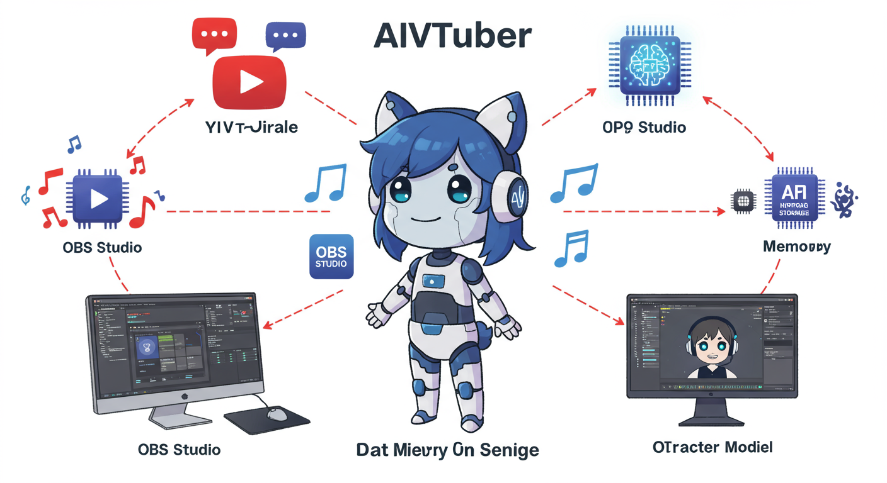
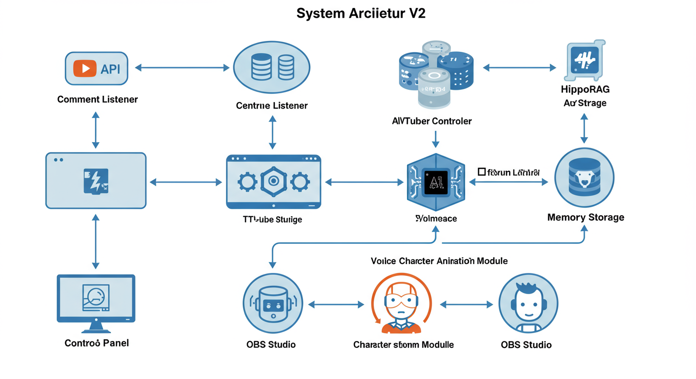
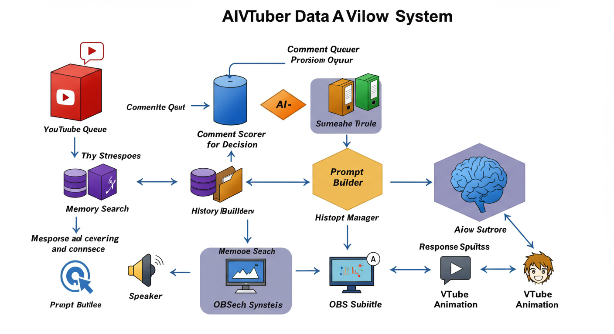
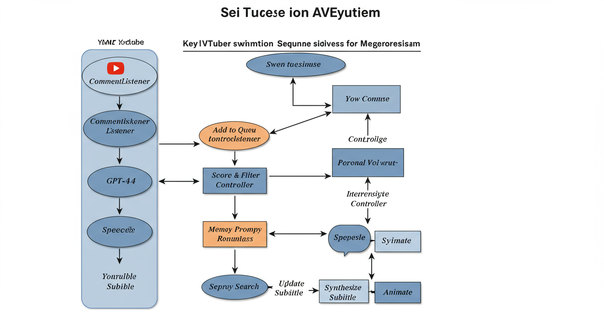

# AIVTuber v2 ビジュアルガイド

このガイドでは、AIVTuber v2の仕組みを画像を使って分かりやすく説明します。

## システム概要



AIVTuber v2は、YouTubeのライブチャットコメントをリアルタイムで処理し、AIが自動的に応答するシステムです。上の図は、システムの主要コンポーネントとその関係を視覚的に表現しています。

### 主要コンポーネント
- **YouTube**: コメントの入力源
- **GPT-4**: AI応答の頭脳
- **OBS Studio**: 配信画面の制御
- **VTube Studio**: キャラクターアニメーション
- **音声合成**: Style-BERT-VITS2による自然な音声
- **記憶システム**: HippoRAGによる長期記憶

## システムアーキテクチャ



この図は、AIVTuber v2の技術的なアーキテクチャを示しています。各コンポーネントがどのように接続され、データがどのように流れるかを表現しています。

### アーキテクチャの特徴
1. **モジュラー設計**: 各機能が独立したコンポーネントとして実装
2. **非同期処理**: リアルタイム性を確保するための並列処理
3. **拡張性**: 新しい機能を容易に追加可能

## データフロー



コメントがどのように処理され、最終的に視聴者に届くまでの流れを示しています。

### 処理の流れ
1. **コメント取得**: YouTubeからリアルタイムでコメントを取得
2. **フィルタリング**: 重要度に基づいてコメントを選別
3. **コンテキスト構築**: 過去の会話や記憶を参照
4. **AI応答生成**: GPT-4が自然な応答を生成
5. **マルチモーダル出力**: 音声、字幕、アニメーションとして出力

## 処理シーケンス



時系列でのコンポーネント間のやり取りを示しています。この図により、各処理がどのタイミングで実行されるかが明確になります。

### 重要なポイント
- **並列処理**: 音声合成、字幕表示、アニメーションは同時に実行
- **非同期通信**: 各コンポーネントは独立して動作
- **エラーハンドリング**: 各ステップでの失敗に対応

## はじめ方

### 1. 環境構築
```bash
# リポジトリのクローン
git clone https://github.com/yourusername/AIVTuber-v2.git
cd AIVTuber-v2

# 依存関係のインストール
pip install -r requirements.txt

# 環境変数の設定
cp .env.example .env
# .envファイルを編集してAPIキーを設定
```

### 2. 外部ツールの準備
- OBS Studioをインストールし、obs-websocketを有効化
- VTube Studioをインストールし、APIを有効化
- Style-BERT-VITS2サーバーを起動

### 3. AIVTuberの起動
```bash
# 簡単な起動方法
python run.py
```

## 詳細情報

より技術的な詳細については、[ARCHITECTURE.md](ARCHITECTURE.md)を参照してください。

## トラブルシューティング

問題が発生した場合は、以下を確認してください：

1. **すべての必要なサービスが起動しているか**
   - OBS Studio
   - VTube Studio
   - Style-BERT-VITS2

2. **APIキーが正しく設定されているか**
   - OpenAI APIキー
   - YouTube APIキー

3. **ログを確認**
   ```bash
   tail -f logs/aivtuber.log
   ```

## サポート

質問や問題がある場合は、GitHubのIssuesで報告してください。